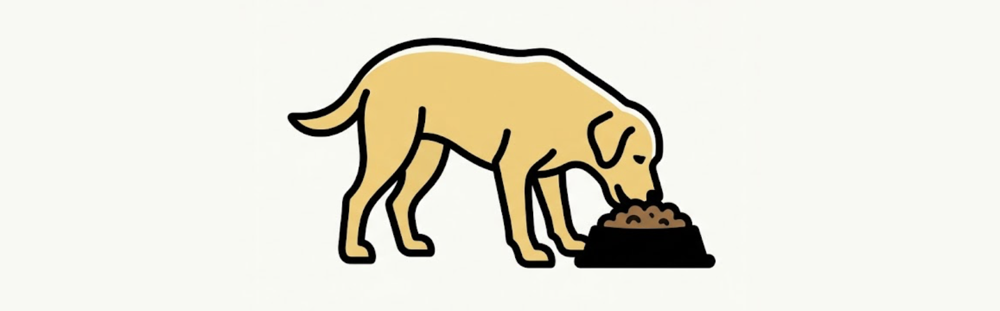

<p align="center">
  
</p>

<h1 align="center">kibble</h1>

<p align="center">The proving ground for your docs.</p>

<p align="center">
  <a href="https://github.com/dcadolph/kibble/releases"></a>
  
  <a href="LICENSE"></a>
</p>

Your README tells people to run `go install ...`, then some setup, then a quickstart.
Every one of those steps rots the moment the code moves, and you are the last to know
because your machine already has everything installed. kibble eats your own dog food: it
runs the documented steps in a clean container from zero, so a broken install fails in
CI instead of in a new user's terminal.

## What it does

kibble reads a repository's README, finds the install commands, and runs each one in a
fresh container with nothing preinstalled. It smoke-tests the installed binary and
reports which steps a brand-new user could actually complete.

- Extracts install commands from fenced, inline, and indented code, so a step written
  inline in prose is not missed.
- Runs each `go install` in a clean `golang` container from zero.
- Runs each `git clone` recipe too: the clone and the build lines that follow it in the
  same code block, with GitHub SSH remotes rewritten to HTTPS for the keyless container.
- Verifies each documented brew formula exists in its tap, without installing it.
- Smoke-tests the binary (`--version`, then `--help`) to confirm it runs, not just builds.
- Checks that every flag and subcommand the README cites still exists in the binary's
  help output, and reports what has drifted.
- Prints a table or JSON, and exits non-zero when a documented install fails.

## Install

```sh
go install github.com/dcadolph/kibble@latest
```

Requires Docker, or a compatible runtime, on the host.

## Usage

Point it at one or more repository directories:

```sh
kibble ./myrepo
kibble ./repo-a ./repo-b
```

Example output:

```
REPO    KIND        STATUS  TIME  DETAIL
myrepo  brew        PASS    1s    formula exists (install not attempted)
myrepo  flag-check  PASS    0s    9 cited flags ok, 4 subcommands cited
myrepo  git-clone   PASS    41s   myrepo version 1.4.0
myrepo  go-install  PASS    28s   myrepo version 1.4.0

4 pass, 0 fail, 0 other of 4 install steps
```

| Flag       | Default       | What                                     &nbsp; |
| ---------- | ------------- | ----------------------------------------------- |
| `-image`   | `golang:1.26` | Container image for clean-room installs.        |
| `-timeout` | `240s`        | Per-step build timeout.                         |
| `-workers` | `3`           | Max concurrent installs.                        |
| `-json`    | `false`       | Emit results as JSON to stdout.                 |
| `-version` | `false`       | Print the version and exit.                     |
| `-strict`  | `false`       | Also fail on timeouts and smoke-test failures.  |

## What it checks today

kibble verifies `go install` steps end to end: the module resolves, it builds from zero,
and the binary runs. A `git clone` step runs as the documented recipe, meaning the clone
line plus the lines that follow it in the same code block, such as `cd` and
`make install`, and whatever lands in the install directory is smoke-tested. A brew step
is verified against its tap, so a renamed or missing formula is caught, but nothing is
installed. A build that exceeds the timeout is reported as `TIMEOUT`, never as a failure,
so a slow network does not fail a build that would otherwise pass.

After a successful install, kibble compares the README against the binary itself. Every
flag cited on a line that invokes the binary, and every subcommand those lines call, is
checked against the collected `--help` output. A flag the binary no longer has, or a
subcommand it rejects, is reported as `DRIFT`. The check is conservative: it only reads
lines that invoke the binary by name, so flags shown for other tools do not count, and
`DRIFT` fails the run only under `-strict`.

## Use it in CI

Add a workflow that fails a pull request when a documented install breaks:

```yaml
name: docs
on: pull_request
jobs:
  kibble:
    runs-on: ubuntu-latest
    steps:
      - uses: actions/checkout@v4
      - uses: dcadolph/kibble@v1
        with:
          repo: .
          # version: v0.3.0   # pin a version, or leave for latest
          # args: -strict      # fail on timeouts and smoke failures too
```

The runner already has Docker, so kibble spins its clean-room containers there.

## Roadmap

- Install brew formulas for real instead of only verifying they exist.
- Run quickstart and example blocks, not just install steps.

## Why "kibble"

Dogfooding means using your own product before you ship it. kibble is the bowl: it feeds
your docs back to a fresh machine and tells you whether they still go down.

## License

MIT. See [LICENSE](LICENSE).
